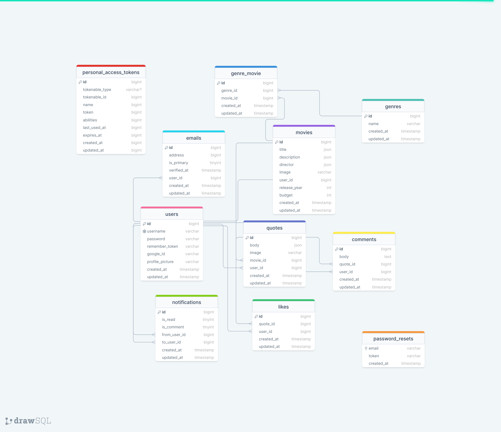

# Epic Movie Quotes

#

## Table of Contents

* [Prerequisites](#prerequisites)
* [Getting Started](#getting-started)
* [Configuration](#configuration)
* [Development](#development)
* [Database Structure](#database-structure)
* [Live Deployment](#live-deployment)

#

## Prerequisites

* _PHP@8.1 and up_
* _composer@2.4 and up_
* _npm@6.14 and up_
* _MYSQL@8 and up_

#

## Getting Started

1. Clone the repository from GitHub:
    ```shell
      git clone https://github.com/RedberryInternship/denis-epic-movie-quotes-back.git
      cd denis-epic-movie-quotes-back
    ```
2. Install PHP dependencies:
    ```shell
      composer install
    ```
3. Install JS dependencies:
    ```shell
      npm install
    ```
4. Create the `.env` file and generate an Application Key:
    ```shell
      cp .env.example .env
      php artisan key:generate
    ```

#

## Configuration

1. Modify the default database configuration in your `.env` file:
   > DB_CONNECTION=mysql <br>
   DB_HOST=127.0.0.1 <br>
   DB_PORT=3306 <br>
   DB_DATABASE=epic_movie_quotes <br>
   DB_USERNAME=<your_username> <br>
   DB_PASSWORD=<your_password> <br>

2. Modify mail configuration in your `.env` file:
   > MAIL_MAILER=&lt;mailer&gt; <br>
   MAIL_HOST=&lt;example.com&gt; <br>
   MAIL_PORT=&lt;0000&gt; <br>
   MAIL_USERNAME=&lt;your_username&gt; <br>
   MAIL_PASSWORD=&lt;password&gt; <br>
   MAIL_ENCRYPTION=&lt;your_password&gt; <br>

3. Modify Pusher configuration in your `.env` file:
   > PUSHER_APP_ID= <br>
    PUSHER_APP_KEY= <br>
    PUSHER_APP_SECRET= <br>
    PUSHER_HOST= <br>
    PUSHER_PORT= <br>
    PUSHER_SCHEME=https <br>
    PUSHER_APP_CLUSTER=eu <br>

4. Configure variables used by Socialite to enable Google OAuth:
    > GOOGLE_CLIENT_ID= <br>
     GOOGLE_CLIENT_SECRET= <br>

5. Assign values to these variables based on your frontend URL:
   > FRONTEND_URL=https://frontend.domain.com <br>
    SANCTUM_STATEFUL_DOMAINS=*.domain.com <br>
    SESSION_DOMAIN=.domain.com <br>

6. Run database migrations:
    ```shell
        php artisan migrate
    ```
   

#

## Development

Start the development server:

```shell
    php artisan serve
```

###

Reformat `.php` files after any changes using PHP Coding Standards Fixer:

```shell
    composer format-all
```

...or set up your IDE to reformat files automatically with rules defined inside `.php-cs-fixer.php`

#

## Database Structure


[DrawSQL Diagram](https://drawsql.app/teams/team-denis/diagrams/final-movie-quotes)



#

## Live Deployment

Frontend: https://moviequotes.denis.redberryinternship.ge 

Backend: https://api.moviequotes.denis.redberryinternship.ge
